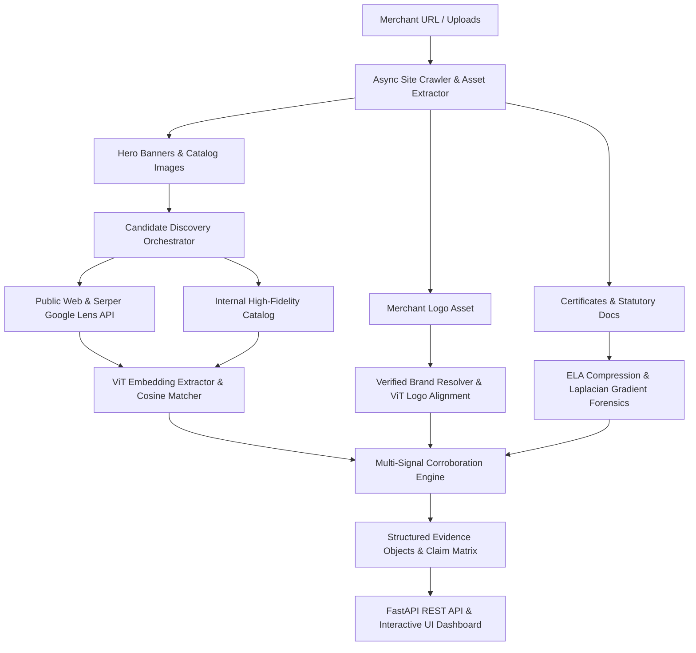

# Visual Consistency Evidence Engine — System Architecture

## 1. System Overview

The **Visual Consistency Evidence Engine** is an automated visual risk corroboration platform designed to evaluate merchant storefront integrity, detect cross-catalog image reuse, flag digital manipulation on statutory documents, and corroborate brand identity alignment without issuing false fraud accusations.



---

## 2. Core Subsystems

### 2.1 Asset Acquisition & Crawling (`backend/crawler/`)
- Extracts rich image assets, distinguishing logos, product catalog items, banners, and statutory certificates.
- Enforces polite crawling standards (respects `robots.txt` compliance rules).

### 2.2 Online Candidate Discovery (`backend/online_evidence/candidate_search.py`)
- Discovers live public web images using multi-query expansion and visual reverse search.
- Queries external image indices and extracts canonical candidate domains and URLs.

### 2.3 Visual Embedding & Similarity Engine (`backend/visual/vit_embeddings.py`)
- Employs Vision Transformer (`google/vit-base-patch16-224`) models to produce 768-dimensional invariant image feature representations.
- Computes cosine similarity matrices across merchant and external candidate visual embeddings.

### 2.4 Digital Tampering & Manipulation Forensics (`backend/visual/manipulation.py`, `services/forensic_heatmap.py`)
- Analyzes Error Level Analysis (ELA) differential compression residues.
- Generates high-frequency gradient anomaly heatmaps for localized document splicing detection.

### 2.5 Multi-Signal Corroboration & Safety Guardrails (`backend/services/visual_risk_scorer.py`)
- **Safety Rule 1:** A single isolated web image match never causes a `HIGH` risk rating (capped at `REVIEW`).
- **Safety Rule 2:** Unregistered or ambiguous brand identities default to `UNAVAILABLE` rather than false negative penalties.
- **Safety Rule 3:** Multi-signal corroboration (e.g. verified brand divergence + corroborated external reuse) triggers targeted `MANUAL_REVIEW`.

---

## 3. Data Contracts & Evidence Pipeline

All outputs conform to standardized Evidence Objects:

```json
{
  "evidence_type": "image_reuse",
  "title": "Product Visual Reuse",
  "score": 85.0,
  "similarity_pct": 85,
  "severity": "HIGH",
  "relationship": "CONTRADICTS",
  "source_type": "ONLINE",
  "source_domain": "external-vendor.com",
  "explanation": "Merchant product imagery strongly matches a candidate visual found on external-vendor.com (85% ViT similarity).",
  "evidence_strength": "HIGH"
}
```
